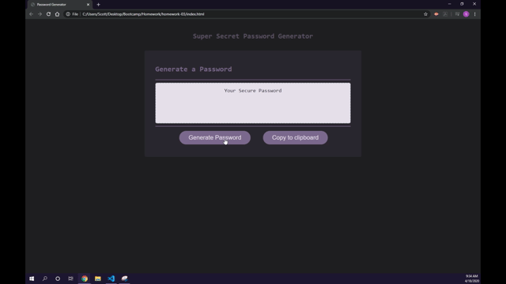
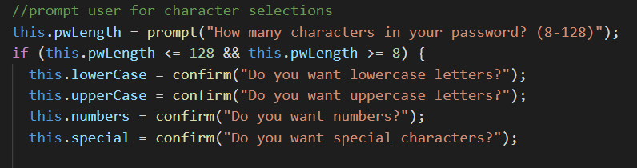
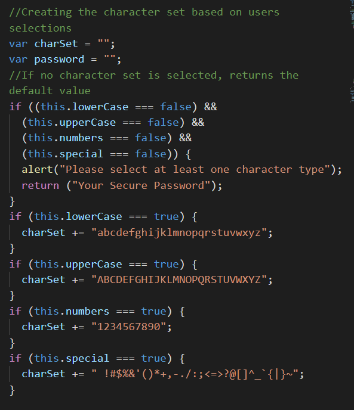
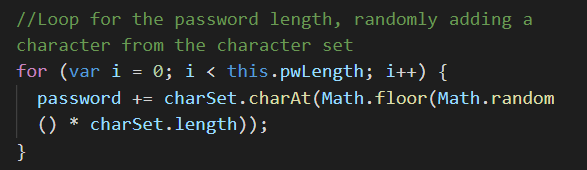

# Password Generator
For this assignment I created a password generator that can create a randomized password based on the users criteria.

## Setting the criteria
Upon clicking the 'generate password' button, the user is prompted to enter the amount of characters they need and to select at least one of the four types of characters.

The 'if' statement in this segment of code ensures that the function will only proceed if a number between 8 - 128 is entered. Anything else such as letters or a different number will prompt the user to try a different input.

## Creating the character set
The next segment of code in the function creates a string based on the criteria the user has set.

This is completed using 'if' statements over and over. I chose to use just 'if' statements instead of 'if else' because this allows my code to be shorter. If the boolean is set to true, this means the user selected those characters as a part of their criteria and the code adds those characters to the charSet string.

## Generating the password
The final part of the function is to actually generate the password. This is completed by having the system choose a random number within the range of the charSet string and to put that character into the password string until the password is as long as the user specified.

Once the password is generated, the writePassword function provided to me, writes the password into the textbox on the page for the user to copy.

## Copy to clipboard
As a bonus to this project I also included a copy to clipboard button. When clicked this button starts a function that selects the text within the password box and executes the users system to 'copy' that text to their clipboard. This allows the user to easily copy and paste their password as needed.
